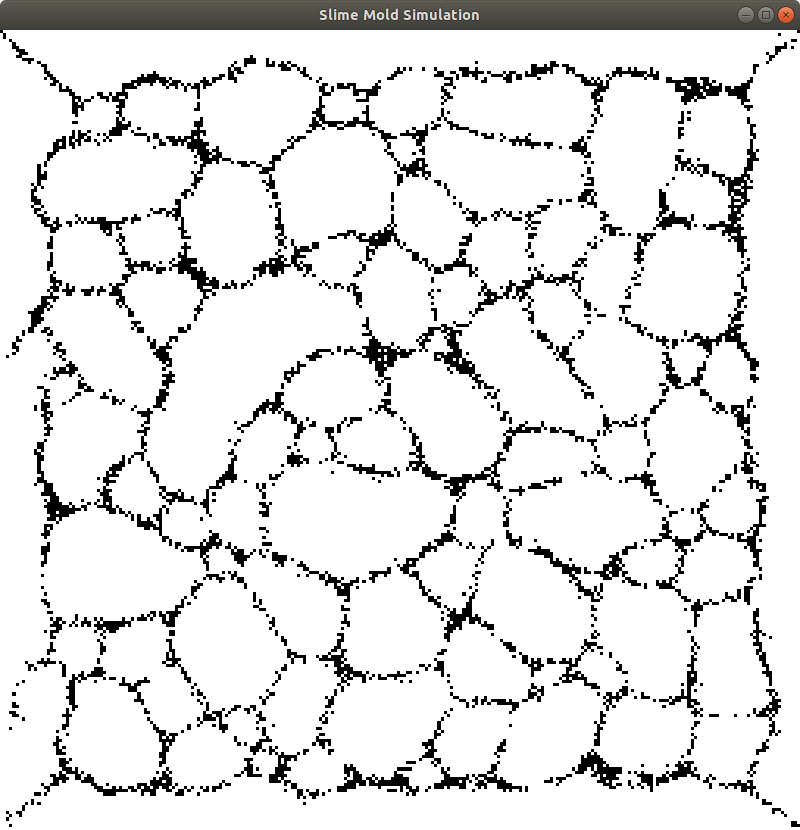

# Slime Mold Simulation
This is a *Physarum* slime mold simulation based on [this paper](./slimemold_paper.pdf) implemented in C++. This repository assumes you're on a standard Linux system like Ubuntu. This is not modern C++ code &mdash; we do manual memory management and use the very old and limited GLUT library for the GUI. Speaking of which, before you run this application, you must install freeglut,

```
sudo apt-get install freeglut3-dev
```

To run the demo,

```
make run
```

After running for a little while, the demo should converge to something that looks like this,

